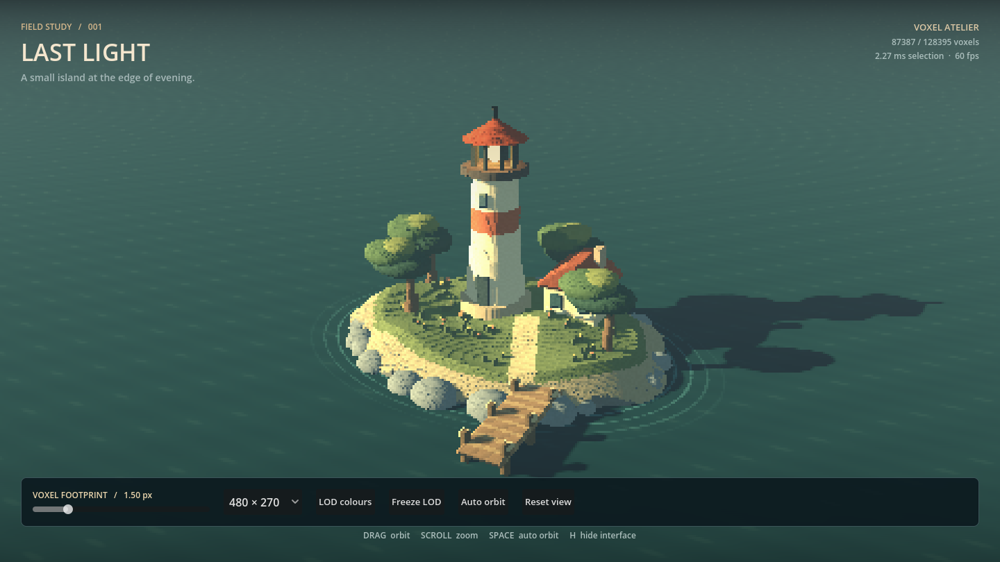

# Last Light — a voxel atelier

A miniature lighthouse island at sunset, built as a Godot C++ GDExtension experiment in screen-space voxel LOD. Ivory masonry, terracotta roofs, wind-shaped pines, a keeper's cottage, flowers and a wooden landing share one sparse surface octree.



## Run

Tested with Godot 4.7.2 on Windows / RTX 3070. The native bindings are pinned to Godot 4.5. Install Visual Studio's Desktop development with C++ workload, Python and SCons:

```powershell
py -m pip install scons
git submodule update --init --recursive
py -m SCons platform=windows target=template_debug
.\run.ps1
```

Or open project.godot in Godot and press F6/F5 after building. Close this project's editor and game before rebuilding its DLL. The helper also supports `./run.ps1 -Build` and `./run.ps1 -SelfTest`.

## Explore

**New: [Motion lab](docs/motion-lab.md)** — open it from the lighthouse to compare a fixed-probe texel-splat core adaptation with object-space voxels under synchronized camera/object motion, reveal, zoom, and threshold jitter. The lab includes a triangle reference and a report explaining the comparison's limits.

- Drag in the scene or use left/right arrows to orbit; scroll to zoom.
- The footprint slider changes the target in **internal** pixels.
- Resolution selects 320×180, 480×270 or 640×360. Default 480×270 scales exactly 3× at the initial 1440×810 window.
- LOD colours displays octree depth; Freeze LOD holds the cut while you move the camera.
- Shading selects One normal / voxel (default), Cube-face normals, or unlit Normal colours. The surface normal is passed as a flat per-instance varying and explicitly replaces the fragment normal on all six faces.
- Receive voxel shadows toggles shadow reception on the voxel material only. Turn it off to separate normal-based lighting from cube self-shadowing; cast shadows on the water and lamp distance attenuation remain.
- Space toggles auto orbit; H hides the interface; Escape exits.

## Renderer

Surface samples are quantized into a world-locked 512³ address space (7.5 cm leaf cells), but only occupied branches are allocated. Each unique leaf contributes equally to its ancestors' position, colour and surface normal. This avoids weighting dense primitive sampling more heavily just because many samples landed in one cell.

Traversal selects one cut through the octree. The projected cell width uses the camera's FOV, aspect policy, internal viewport dimensions and camera-space depth to a conservative near face:

```text
focal_pixels = viewport_axis / (2 × tan(fov / 2))
projected_width = cell_width × focal_pixels / max(near, depth - cell_radius)
```

A 12% hysteresis band keeps a node's split state stable near transitions. No temporal antialiasing is used. History therefore intentionally affects counts near a boundary. The selected representatives use filtered positions/colours/normals, and GPU-instanced cubes provide depth and shadow rasterization. A single packed MultiMesh buffer is uploaded only when the cut or diagnostic colours change; static frames do not rebuild a mesh.

The lighting uses a warm, low directional sun with shadows, cool ambient fill, matte materials, a lit lantern and subtle distance fog. Water and the lantern bulb are conventional meshes. The sea is a small procedural shader with restrained ripples and approximate shoreline foam.

This is a **CPU octree selector with GPU instanced rasterization**, not a custom compute renderer, SDF raymarcher, Nanite implementation, or GPU visibility system. The choice keeps the experiment editable and lets it use Godot's lighting/shadows. Selection currently visits the whole island, including off-screen parts, to retain shadow casters.

## Limits of the experiment

The target is a cell-width heuristic, not a guarantee of one voxel for every screen pixel. Finite leaf resolution caps detail close up. Cubes overlap by 8%, and their filtered centroid offsets are bounded to 2.5% of cell width to reduce gaps. Filtered parents can widen silhouettes, merge thin features, and blend material boundaries at coarse settings. Normal averaging is stable but loses multimodal surface detail. Hysteresis reduces popping without eliminating it. The shader sea and full-scene shadow work are outside the LOD budget.

## Validation

`run.ps1 -SelfTest` checks that every source leaf is represented by exactly one selected ancestor, that coarser targets reduce the selected count, frozen cuts remain unchanged while moving, retreating reduces detail, and increased render resolution restores detail.

The current scene contains approximately 128,000 occupied source voxels. The default view reached 60 fps on this machine at 480×270; CPU selection was approximately 2–3 ms. A cold 4-pixel view selected approximately 6,000 representatives. These are observations, not portable performance guarantees.

For deterministic view capture:

```powershell
godot --path . -- --capture=C:/absolute/path/view.png
godot --path . -- --capture=C:/absolute/path/lod.png --footprint=4 --lod
godot --path . -- --self-test
godot --path . -- --capture=C:/absolute/path/normals.png --normals=2 --footprint=4
godot --path . -- --capture=C:/absolute/path/faces.png --normals=1 --footprint=4
godot --path . -- --capture=C:/absolute/path/surface.png --no-voxel-shadows
```

The screenshot saves after 150 rendered frames. Water animation is time-based.

All scene geometry and shaders were authored for this demo; no external art assets are required.
